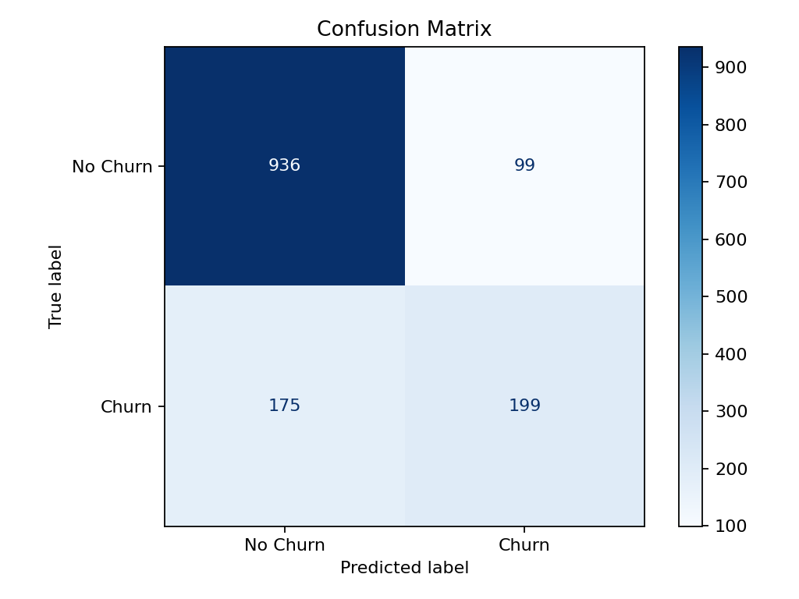
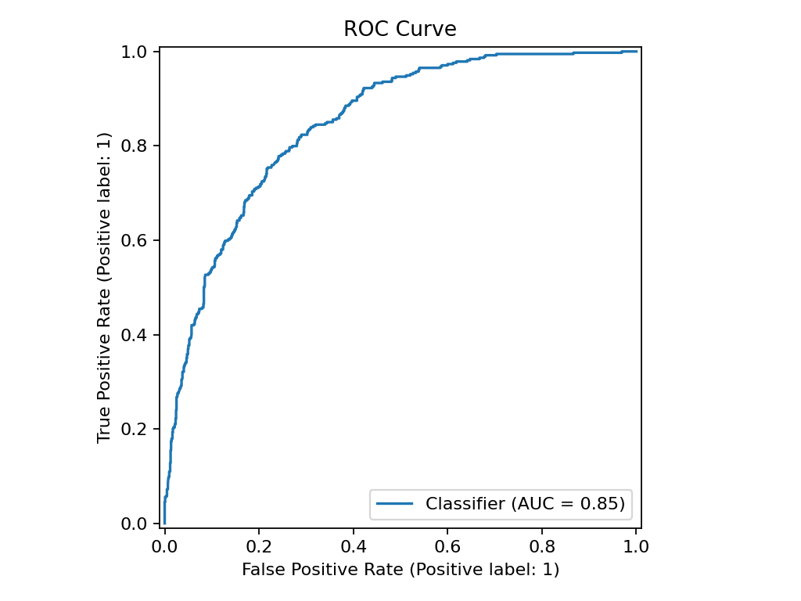
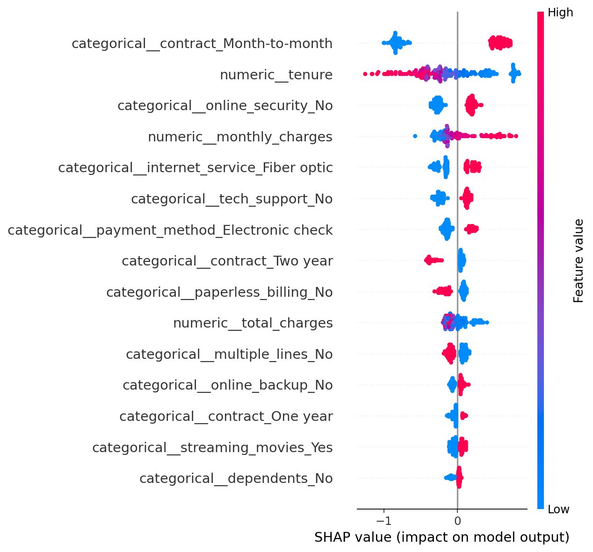

# End-to-End Data Science Pipeline: Customer Churn Prediction

## Project Overview

This project demonstrates a complete data science workflow for predicting telecom customer churn. It starts with raw data, performs data-quality assessment and exploratory analysis, builds leakage-safe preprocessing pipelines, compares multiple machine learning models, explains the selected model, and serves predictions through Streamlit and FastAPI.

## Why This Project Matters

Customer churn is a practical business problem: retaining existing customers is often cheaper than acquiring new ones. A churn model helps teams identify high-risk customers, understand the main churn drivers, and prioritize retention actions. For a graduate application portfolio, this project shows both analytical depth and engineering ability.

## Dataset

- Dataset: Telco Customer Churn
- Rows: 7,043
- Target: `churn`
- Task type: binary classification
- Raw file: `data/raw/WA_Fn-UseC_-Telco-Customer-Churn.csv`
- Data-quality note: `total_charges` contains 11 blank values, handled through train-only preprocessing imputation.

## Pipeline

1. Load raw data from `data/raw/`.
2. Normalize column names to snake_case.
3. Generate data-quality summary tables.
4. Create EDA figures for target distribution, numeric distributions, categorical churn rates, and numeric correlations.
5. Prepare modeling features and encode the churn target.
6. Split data with stratification.
7. Fit preprocessing with `ColumnTransformer` only on training data.
8. Train and compare Logistic Regression, Random Forest, Gradient Boosting, SVM, and XGBoost.
9. Tune the best model with a compact grid search.
10. Save the best model bundle and explain it with SHAP plus permutation importance.
11. Serve predictions with Streamlit and FastAPI.

## Model Comparison

| Model | Accuracy | Precision | Recall | F1 | ROC-AUC |
|---|---:|---:|---:|---:|---:|
| Logistic Regression | 0.7381 | 0.5043 | 0.7834 | 0.6136 | 0.8413 |
| Random Forest | 0.7835 | 0.5848 | 0.6364 | 0.6095 | 0.8331 |
| Gradient Boosting | 0.8062 | 0.6735 | 0.5241 | 0.5895 | 0.8434 |
| SVM | 0.7438 | 0.5115 | 0.7727 | 0.6155 | 0.8211 |
| XGBoost | 0.8055 | 0.6678 | 0.5321 | 0.5923 | 0.8452 |
| XGBoost (tuned) | 0.8055 | 0.6678 | 0.5321 | 0.5923 | 0.8467 |

## Best Model Result

The selected model is **XGBoost (tuned)** with ROC-AUC of **0.8467** on the held-out test set. ROC-AUC is used as the primary selection metric because churn prediction benefits from ranking customers by risk, not only maximizing accuracy.

## Screenshots and Artifacts







Additional outputs:

- `reports/data_quality_report.md`
- `reports/model_comparison.md`
- `reports/final_report.md`
- `docs/model_card.md`
- `models/best_model.joblib`

## How To Run

Install dependencies:

```bash
python -m pip install -r requirements.txt
```

Run tests:

```bash
python -m pytest -q
```

Train models and regenerate reports:

```bash
python -m src.train
```

Generate explainability artifacts:

```bash
python -m src.explain
```

Run the Streamlit dashboard:

```bash
streamlit run app/streamlit_app.py
```

Run the FastAPI service:

```bash
uvicorn app.api:app --reload
```

Then open `http://127.0.0.1:8000/docs` for the interactive API documentation.

## Repository Structure

```text
end-to-end-data-science-pipeline/
├── app/
│   ├── api.py
│   └── streamlit_app.py
├── data/
│   ├── raw/
│   └── processed/
├── docs/
│   ├── model_card.md
│   └── project_design.md
├── models/
│   └── best_model.joblib
├── notebooks/
│   ├── 01_data_understanding.ipynb
│   ├── 02_eda.ipynb
│   └── 03_model_experiments.ipynb
├── reports/
│   ├── figures/
│   ├── data_quality_report.md
│   ├── final_report.md
│   └── model_comparison.md
├── src/
│   ├── data_loader.py
│   ├── eda.py
│   ├── evaluate.py
│   ├── explain.py
│   ├── features.py
│   ├── predict.py
│   ├── preprocessing.py
│   └── train.py
└── tests/
```

## Limitations

- The dataset is static and may not represent current telecom behavior.
- The decision threshold is fixed at 0.5; production use should tune thresholds by business cost.
- The model does not include customer interaction history, campaign exposure, or competitor data.
- The app is a local demo, not a production deployment.

## Future Work

- Add MLflow experiment tracking.
- Add Docker for one-command environment setup.
- Add GitHub Actions for automated testing.
- Add data drift checks and scheduled retraining.
- Calibrate probabilities and tune thresholds for retention campaign cost.
